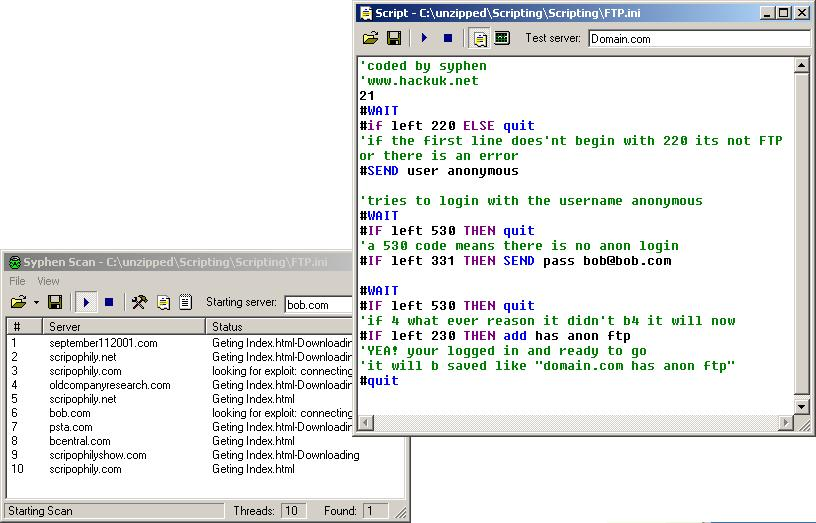



## \[Syphen Scan\]

### Description

*Syphen scan crawls the Internet executing a script at each site. It’s a good tool for looking for web servers with certain characteristics or running a certain type of software. (syphen scan is not intended as a hacking tool or exploit scanner)
 
### More Info
 

             |
---                |---
**Submitted On**   |2002-07-23 14:08:34
**By**             |[syphen\_2k](https://github.com/Planet-Source-Code/PSCIndex/blob/master/ByAuthor/syphen-2k.md)
**Level**          |Intermediate
**User Rating**    |4.0 (32 globes from 8 users)
**Compatibility**  |VB 6\.0
**Category**       |[Internet/ HTML](https://github.com/Planet-Source-Code/PSCIndex/blob/master/ByCategory/internet-html__1-34.md)
**World**          |[Visual Basic](https://github.com/Planet-Source-Code/PSCIndex/blob/master/ByWorld/visual-basic.md)
**Archive File**   |[Syphen\_Sca1095387232002\.zip](https://github.com/Planet-Source-Code/syphen-2k-syphen-scan__1-37186/archive/master.zip)

